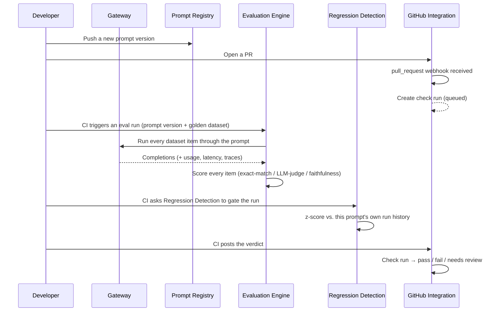

# AI Reliability Platform

A modular, self-hostable control plane that continuously evaluates, monitors, and
validates LLM applications across Claude, GPT, Gemini, and local Llama/Ollama models —
before and after deployment.

This is not a chatbot. It is a CI gate, an observability stack, and an evaluation lab
for production AI systems — the same discipline traditional software gets from unit
tests, CI, and APM, applied to prompts and models instead of just code.

**Status: v1.0.** 16 services, a React dashboard, and a deployment story (docker-compose
for dev, Helm/Kubernetes for real clusters) — all built and tested. See
[Status](#status) below for the full breakdown.

---

## Why

Teams ship LLM features the way they shipped software before CI/CD existed: change a
prompt, eyeball a few outputs, merge, hope. There's usually no equivalent of a unit
test suite that catches a quality regression before it reaches users, no history of
"how has this prompt's score trended over the last 50 versions," and no automatic
answer to "did this PR make the model worse, and by how much" — just vibes and a
Slack message after the fact.

Meanwhile the operational side — cost per request, latency, which provider is
answering which call, whether a response is actually grounded in the context it was
given — is usually bolted on after the fact with ad hoc logging, if at all.

This platform exists to make both of those first-class, automated, and boring in the
good way:

- **A regression gate for prompts**, the same way a test suite gates code — an eval
  run's score gets compared statistically against that prompt's own history, and a
  GitHub check run either passes, fails, or asks for review before a PR merges.
- **A single point of observability** for every LLM call — which model, how many
  tokens, how much it cost, how long it took, whether it hallucinated — regardless of
  which of the four supported providers actually served it.
- **Nothing proprietary or hosted.** Every piece runs on your own infrastructure, in
  containers you build, against a database you control.

## How it works

A typical loop, end to end:



Everything in that loop is also just... an API you can call directly, or a screen in
the dashboard you can look at. The Gateway is a normal chat-completions endpoint you
can point any app at today; the Evaluation Engine, Cost Analytics, and Trace Collector
keep working whether or not you ever wire up the CI gate at all.

## Architecture

See [`docs/architecture/overview.md`](docs/architecture/overview.md) for the full
system design (service catalog, bounded contexts, database schema, API conventions,
event/queue architecture) and [`docs/architecture/decisions/`](docs/architecture/decisions/)
for the reasoning behind specific choices — every non-obvious decision in this repo has
a numbered ADR explaining *why*, not just *what*.

### Guiding constraints

- **No monolith.** Fourteen independently deployable services, each owning its own
  database schema and REST API. Nothing imports another service's code or reads its
  tables directly.
- **Clean Architecture per service.** `domain → application → infrastructure → api`
  layering; the domain layer never imports a framework or an ORM, so business logic is
  testable without a database, a broker, or a running server.
- **Domain-Driven Design at the seams.** Service boundaries are bounded contexts, not
  tables split arbitrarily.
- **CI-native.** The GitHub check-run gate is a first-class product surface, not a
  bolt-on script.
- **LangGraph is deferred.** Reserved for an optional, later AI debugging assistant —
  it does not touch the gateway or evaluation core.

### The services

| Service | Owns | Depends on |
|---|---|---|
| **Gateway** | Unified chat-completion API across Claude, GPT, Gemini, Ollama | Auth, Trace Collector, Cost Analytics |
| **Authentication** | Orgs, users, API keys, JWTs, RBAC | — |
| **Prompt Registry** | Prompt templates, versions, diffing, environment promotion | Auth |
| **Dataset Management** | Golden datasets, versioned bulk import | Auth |
| **Trace Collector** | OTel span ingestion, storage, trace viewer | — |
| **Evaluation Engine** | Eval-run orchestration, scorer registry, run results | Prompt Registry, Dataset Management, Gateway, Hallucination Detection |
| **Hallucination / Faithfulness Detection** | Claim extraction + context-grounded verification | Gateway |
| **Experiment Tracking** | Cross-run comparison, score history | Evaluation Engine |
| **Cost & Token Analytics** | Usage ledger, per-org budgets | — |
| **Regression Detection** | Statistical baselines, gate decisions, latency-anomaly checks | Evaluation Engine, Trace Collector |
| **Report Generator** | HTML/PDF run reports | Experiment Tracking |
| **Notification Service** | Slack/email/webhook delivery | — |
| **GitHub Integration** | Webhooks, check runs, PR comments — the CI-facing surface | Regression Detection |
| **Dashboard Backend** | Aggregated, read-only view models for the UI | all read-facing services |

Plus a **React Dashboard** (`frontend/`) that talks only to the Dashboard Backend (and,
for auth and report downloads, directly to Auth and the Report Generator).

Three services also run a Celery worker alongside their API (Evaluation Engine, Report
Generator, Notification Service) for anything that shouldn't block an HTTP response —
running a full eval, rendering a report, delivering a notification.

### Observability

Every FastAPI service exposes `GET /metrics` (`prometheus-fastapi-instrumentator`) and
`GET /healthz`. Two Grafana dashboards ship pre-provisioned: a templated per-service
HTTP overview (request rate, error rate, latency percentiles) and a Cost & Token
Analytics dashboard reading straight from Postgres. See
[ADR-0007](docs/architecture/decisions/0007-prometheus-metrics-and-grafana-dashboards.md).

### Deployment

`infra/docker-compose.yml` for local development; a generic, 17-times-aliased Helm
chart under `infra/k8s/helm/` for Kubernetes — one chart, one set of templates, driven
entirely by values, rather than 17 bespoke charts to keep in sync. See
[ADR-0008](docs/architecture/decisions/0008-kubernetes-deployment-shared-chart.md) and
[`docs/deployment.md`](docs/deployment.md).

## How to use it

### Run the whole stack locally

```bash
git clone <this repo>
cd "Ai platform"

# each service needs its own .env — copy the template and fill in secrets
for svc in services/*/; do cp "$svc/.env.example" "$svc/.env"; done
# at minimum, put real provider keys in services/gateway/.env
# (GATEWAY_ANTHROPIC_API_KEY / GATEWAY_OPENAI_API_KEY / GATEWAY_GEMINI_API_KEY)

cd infra
docker compose up --build
```

That brings up Postgres, Redis, Prometheus, Grafana, and all 14 backend services. Then,
separately, the dashboard:

```bash
cd frontend
npm install
cp .env.example .env
npm run dev
```

Open `http://localhost:5173`, register an org, sign in, and you're looking at live eval
runs, cost, regression status, and traces. See [`docs/deployment.md`](docs/deployment.md)
for the full port map, Grafana/Prometheus access, and the Kubernetes path.

### Use one service on its own

Every service is independently runnable — see its own `README.md` under
`services/<name>/`. A minimal loop with just the Gateway:

```bash
cd services/gateway
python -m venv .venv && source .venv/bin/activate
pip install -e ".[dev]"
cp .env.example .env   # add a provider API key
uvicorn gateway.api.main:app --reload
```

```bash
curl -X POST http://localhost:8000/api/v1/chat \
  -H "Authorization: Bearer dev-local-key" \
  -H "Content-Type: application/json" \
  -d '{"model": "claude-sonnet-5", "messages": [{"role": "user", "content": "hi"}]}'
```

### Wire up the CI gate

1. Create a prompt in the Prompt Registry, import a golden dataset in Dataset
   Management.
2. Point the GitHub Integration service's webhook at your repo (`POST
   /webhooks/github/{org_id}`), so opening a PR creates a queued check run.
3. In CI, trigger an eval run against the Evaluation Engine, then call GitHub
   Integration's `POST /api/v1/checks/{id}/complete` with the run id — it asks
   Regression Detection for a gate decision and updates the check run on GitHub.

See [`services/github-integration/README.md`](services/github-integration/README.md)
for the exact flow.

## Repository layout

```
services/     one folder per deployable service (see overview.md for the list)
libs/         shared kernel — just auth-client; see the note below
frontend/     React dashboard
infra/        docker-compose, Helm/Kubernetes manifests, Prometheus/Grafana config
docs/         architecture docs, ADRs, deployment guide, generated OpenAPI specs
```

`libs/` originally scaffolded `contracts/`, `otel-instrumentation/`, and
`testing-fixtures/` alongside `auth-client/` — all three stayed empty. OTel
instrumentation ended up living directly in each service's own
`infrastructure/observability/` (see ADR-0004), request/response contracts turned
out to be per-service Pydantic schemas rather than a shared package, and the
SQLite-repository-test pattern (see ADR-0002) is copy-pasted per service's
`tests/integration/` rather than shared — each a case of the actual implementation
finding a better seam than the one guessed at during initial planning. Removed
rather than left as dead scaffolding.

Gateway, Prompt Registry, Dataset Management, the Evaluation Engine, Hallucination
Detection, Experiment Tracking, Cost Analytics, Regression Detection, the Report
Generator, the Notification Service, GitHub Integration, and the Dashboard Backend
all depend on the shared `libs/auth-client` package. Install it before each service's
own dependencies: `pip install -e libs/auth-client` — see the affected services'
READMEs.

The React Dashboard (`frontend/`) is a separate Vite dev server, not part of
`infra/docker-compose.yml` — see `frontend/README.md` for setup. It talks to the Auth
service, the Report Generator, and the Dashboard Backend directly over HTTP, so those
three need `*_CORS_ALLOWED_ORIGINS` set to the dashboard's origin (defaults to
`http://localhost:5173`, already the default in each service's `.env.example`).

## License

MIT — see [`LICENSE`](LICENSE).
