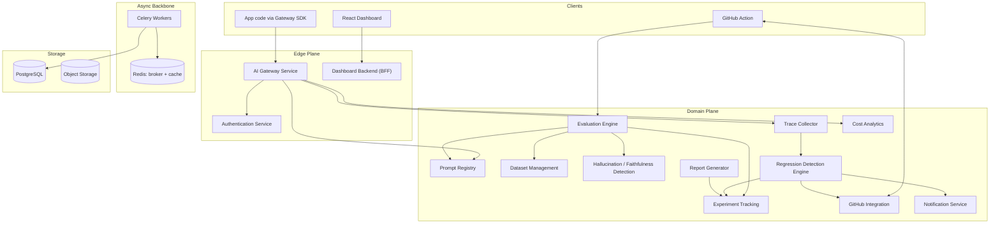

# System design — overview

Full v0.1 design was reviewed and approved 2026-07-19. This document is the
repo-resident reference; ADRs for individual decisions live in
[`decisions/`](decisions/). All 16 weeks of the development plan below shipped —
v1.0 — as of 2026-07-25; see [`docs/deployment.md`](../deployment.md) for how to
run it and [ADR-0007](decisions/0007-prometheus-metrics-and-grafana-dashboards.md)/
[ADR-0008](decisions/0008-kubernetes-deployment-shared-chart.md) for the final
week's observability and deployment decisions.

## Principles

- No monolith — fourteen independently deployable services, each owning its
  own database schema and REST API.
- Clean Architecture inside every service: `domain → application →
  infrastructure → api`. Nothing in `domain/` imports a framework or an ORM.
- Domain-Driven Design at the seams: service boundaries are bounded contexts,
  not tables split arbitrarily.
- CI-native: the GitHub Action regression gate is a first-class product
  surface.
- LangGraph is deferred to an optional, later AI debugging assistant — it
  does not touch the gateway or evaluation core.

## High-level architecture

## Service catalog

| Service | Owns | Mode | Depends on |
|---|---|---|---|
| AI Gateway | Provider routing, normalization, streaming | sync | Prompt Registry, Auth, Trace Collector, Cost Analytics |
| Authentication | Orgs, users, API keys, RBAC, JWT | sync | none |
| Prompt Registry | Prompt templates, versions, promotion | sync | Auth |
| Dataset Management | Golden datasets, items, versioning | sync | Auth |
| Evaluation Engine | Eval run orchestration, scorer registry, run results (see ADR-0005) | async | Prompt Registry, Dataset Mgmt, Gateway, Hallucination Detection |
| Hallucination / Faithfulness | Groundedness scoring, claim extraction | async | Gateway |
| Trace Collector | OTel span ingest, storage, indexing | sync ingest / async index | none |
| Regression Detection | Baselines, drift, gate decisions (see ADR-0005) | async | Evaluation Engine, Trace Collector |
| Cost Analytics | Token/cost ledger, budgets | async | Gateway, Trace Collector |
| Experiment Tracking | Cross-run comparison/aggregation (see ADR-0005) | sync | Evaluation Engine |
| Report Generator | HTML/PDF run reports | async | Experiment Tracking |
| GitHub Integration | Webhooks, check runs, PR comments | sync | Regression Detection |
| Dashboard Backend | Aggregated view models for the UI | sync | all read-facing services |
| Notification Service | Slack/email/webhook delivery | async | none |

## Database

One PostgreSQL cluster, one schema per service at MVP scale
(`prompt_registry.*`, `eval_engine.*`, …). No service reads another service's
tables directly — cross-service reads go through REST, cross-service
reactions go through a domain event on Redis/Celery. See ADR-0002.
`eval_engine.*` owns run results directly rather than Experiment Tracking
owning a duplicate copy — see ADR-0005 for why that refines this draft.

## Development plan

Sequenced so every week ships something that runs end-to-end and only
depends on services already built:

1. AI Gateway — 2. Authentication — 3. Prompt Registry — 4. Dataset
Management — 5. Trace Collector + OTel — 6. Evaluation Engine (core) — 7.
Hallucination / Faithfulness Detection — 8. Experiment Tracking — 9. Cost &
Token Analytics — 10. Regression Detection Engine — 11. Report Generator —
12. Notification Service — 13. GitHub Integration — 14. Dashboard Backend —
15. React Dashboard — 16. Hardening & v1.0 release.

Each service is code-complete — tested and documented — before the next one
starts.
